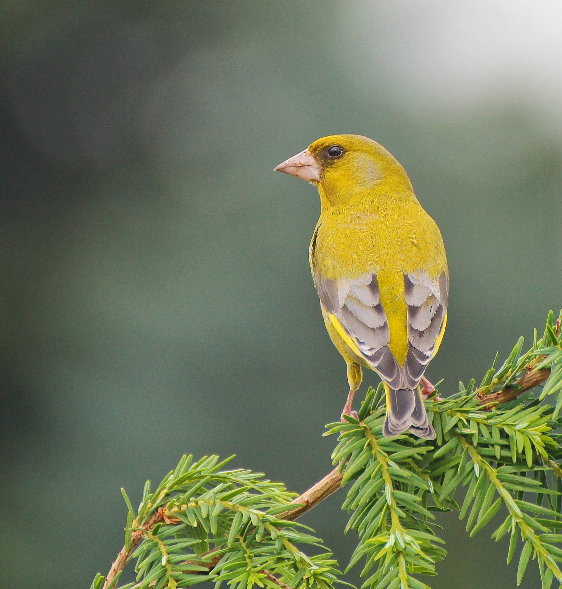

# JavaScript HTML Content and Image Changer

This simple web page demonstrates how to use JavaScript to change both the HTML content and images dynamically. The page includes a button to change the text content and buttons to change the displayed image.

## HTML Structure

The HTML file (index.html) contains the following elements:

- <h1> element displaying a title.
- 
 element with an initial content.
- A button with the id "btn" to change the content.
- Another <h1> element for image-related instructions.
- An  element with the id "bird" displaying an initial image.
- Buttons with different ids to change the image source.

## JavaScript Logic

The JavaScript file (script.js) provides the functionality to change the content and images:

### Content Change

- It sets variables references for the HTML elements.
- Adds an event listener to the "Change Content" button.
- When the button is clicked, it changes the content of the 
 element.

### Image Change

- It gets references to HTML buttons and the image element.
- Adds event listeners to each image-related button.
- When a button is clicked, it changes the src attribute of the image element to display a different image.

## How to Use

1. Open index.html in a web browser.
2. Click the "Change Content" button to change the content.
3. Click the buttons (e.g., "Kingfisher," "Chick," "Owl," "Weaver Bird") to change the displayed image.

Feel free to modify the HTML and JavaScript files to suit your needs.

## Author

[SQCODES]

## License

This project is licensed under the MIT License - see the [LICENSE](LICENSE) file for details.